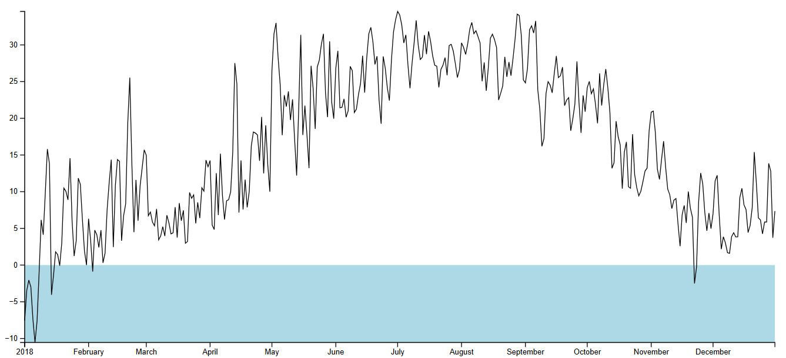
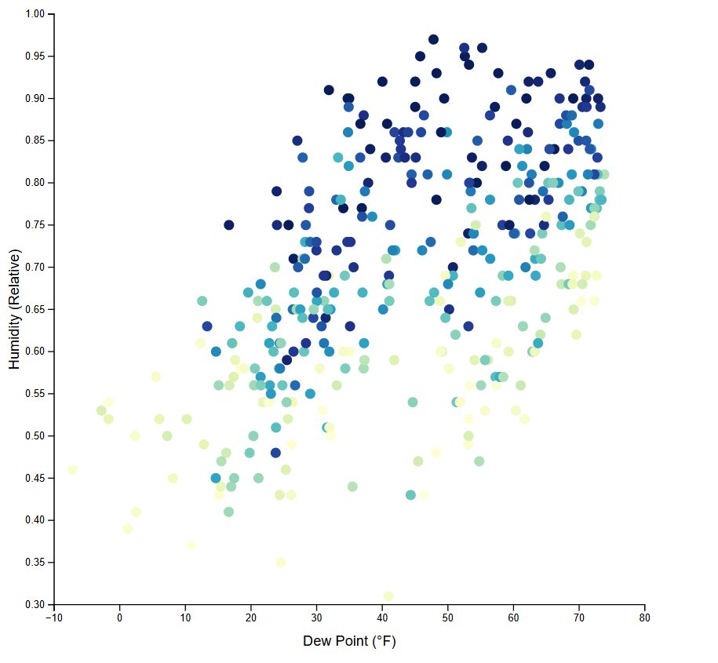

# Data Visualization with JavaScript

Interactive data visualizations built with **D3.js** using real-world weather data.

---

## 📸 Preview

### Line Chart


### Scatter Plot


---

## Projects

### 📈 Line Chart
Visualizes daily maximum temperatures over a full year. Temperatures are converted from Fahrenheit to Celsius. A light blue area marks temperatures below freezing point (0°C).

### 📊 Scatter Plot / Histogram
Interactive histogram that displays distributions of different weather metrics. Includes animated transitions, a dynamic mean line, and an interactive tooltip on hover.

---

## Features

- Real-world weather dataset (JSON)
- Animated transitions when switching metrics
- Interactive tooltip showing value range and day count
- Freezing point reference area in line chart
- "Change Metric" button to explore different weather variables

---

## Tech Stack

- **D3.js v7** — scales, axes, SVG rendering and transitions
- **HTML5 / CSS3 / JavaScript (ES6+)**

---

## Project Structure

```
Projects/
├── Assets/Screenshots/
│   ├── LineChart.png
│   └── ScatterPlot.png
├── data/
│   └── my_weather_data.json
├── LineChart/
│   ├── index.html
│   └── js/script.js
└── ScatterPlot/
    ├── index.html
    └── js/script.js
```

---

## 🧰 Languages & Technologies


